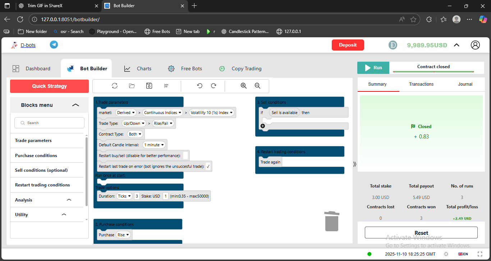
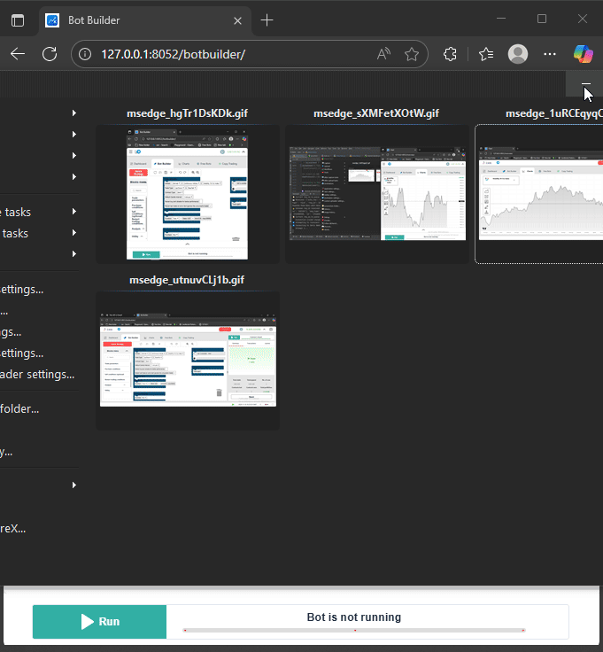
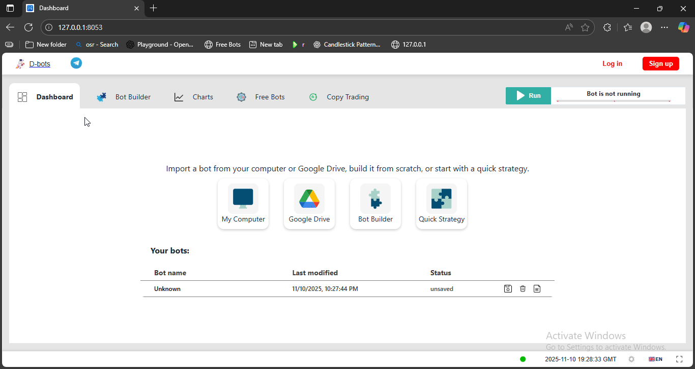

# ⚡ Django Channels WebSocket Showcase

> A professional **real-time data streaming demo** built with Django Channels & asyncio — showcasing tick updates, live charting, and task management.


A **Django Channels WebSocket consumer** for managing **real-time tick and candle data** and **live trade results**.  
This project demonstrates **professional async consumer architecture** suitable for **trading dashboards** and **live-data applications**.

---

## 🧩 Overview

`TickDataConsumer` provides:

- 🔄 Real-time tick and candle updates via WebSocket  
- 📈 Live simulation of trade/contract results  
- ⚡ Async task management for streaming data  
- 🛠 Clean connection lifecycle and task shutdown  

This project serves as a **showcase/demo** for developers to learn how to build **efficient, real-time systems** using Django Channels and asyncio.

---

## 🧠 Key Features

| Feature | Description |
|----------|-------------|
| **Async Consumer** | Non-blocking WebSocket handler using `AsyncWebsocketConsumer` |
| **Real-Time Data** | Simulated tick/candle streams with live updates |
| **Trade Results** | Mock display of contracts bought, won/lost, profit/loss |
| **Task Management** | Background tick/trade tasks that can be safely cancelled |
| **Group Subscriptions** | Isolated channels for ticks and trade updates per client |

---

## 🚀 How It Works

1. Client connects via WebSocket → `connect()` runs  
2. Client joins **groups**:  
   - `tick_data_{client_id}`  
   - `trade_updates_{client_id}`  
3. Frontend sends event messages:
   - `"subscribe_ticks"` → starts tick stream  
   - `"show_trade_results"` → starts trade simulation  
   - `"stop_all"` → cancels background tasks  
4. Consumer streams updates back to the client:

```json
{
  "event": "tick_update",
  "symbol": "SYMBOL_XYZ",
  "price": 101.23
}
```
```json
{
  "event": "trade_update",
  "data": {
    "contract": "CALL",
    "status": "Won",
    "profit": 3.20
  }
}
```

On disconnect → tasks are cancelled, groups are cleaned up.

---

## 🛠️ Tech Stack

- Backend: Django + Django Channels

- Async Engine: Python asyncio

- Data Format: JSON over WebSocket

- Frontend Compatible With: Vanilla JS, HTMX, or TradingView-style charting libraries

---

## 📂 File Structure (Example)
```bash

tick_showcase/
├─ __init__.py
├─ consumers.py       # TickDataConsumer code
├─ routing.py         # WebSocket URL routing
└─ README.md

```

---

## ⚙️ Setup & Installation
```bash
# 1️⃣ Clone the repository
git clone https://github.com/kaiseremanuel/tick-showcase.git
cd tick-showcase

# 2️⃣ Create and activate a virtual environment
python -m venv venv
source venv/bin/activate       # On Windows use: venv\Scripts\activate

# 3️⃣ Install dependencies
pip install -r requirements.txt

# 4️⃣ Run the Django development server
python manage.py runserver

```
---

## ⚡ Frontend Usage Example (JavaScript)

```javascript

const ws = new WebSocket("ws://localhost:8000/ws/tick/?client_id=123");

ws.onmessage = (msg) => {
    const data = JSON.parse(msg.data);
    console.log(data);
};

ws.onopen = () => {
    ws.send(JSON.stringify({ event: "subscribe_ticks", symbol: "SYMBOL_XYZ" }));
    ws.send(JSON.stringify({ event: "show_trade_results" }));
};

// Optionally stop all streams
// ws.send(JSON.stringify({ event: "stop_all" }));

```

---

## 🎥 Demo Showcase

*(All GIFs recorded using ShareX at 15 FPS — optimized for smooth playback and small size.)*

Below are short GIF previews showing different real-time features of the project.

| Bot Running                             | Theme Toggle | Live Chart                            | Dashboard Navigation               |
|-----------------------------------------|---------------|---------------------------------------|------------------------------------|
|  |  |  |  |

---

## 📌 Notes

This is a demo/mock consumer — prices and trade results are simulated.

Perfect for showcasing async WebSocket design and frontend integration.

Can be extended to integrate real market data and live bot results.

---
## 🧑‍💻 Author

Kaiser Emanuel Kinda  
Showcasing professional Django Channels WebSocket architecture.

📧 Email: kaiserkida@gmail.com  
🌐 Portfolio / Demo Repo: [https://github.com/kindake/kaiser-dev-showcase](https://github.com/kindake/kaiser-dev-showcase)  
🐙 GitHub: [@kindake](https://github.com/kindake)

---

## 🪪 License

This project is licensed under the MIT License — you’re free to use, modify, and distribute it with attribution.

---

## 💼 Why This Project Matters

This project demonstrates how I build **production-ready, asynchronous Django systems** with clean architecture and attention to performance.

**Recruiters / Collaborators:**  
If you’d like to see how this architecture can scale or connect to real market APIs (Deriv / Binance), I’d be happy to discuss and demonstrate integration.

📩 Contact: [kaiserkida@gmail.com](mailto:kaiserkida@gmail.com)  
🌐 Portfolio / GitHub: [https://github.com/kindake](https://github.com/kindake)
